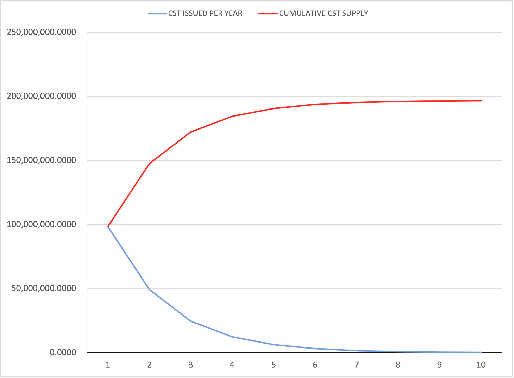

# CST

**The CStable DAO token (CST) is a ERC-20 token on Celo Blockchain that will act as the governance token for the CStable DAO. CST will also incentivize participation in the protocol through Pay to Earn**

## **Use Cases**

Soon, CST holders will also be able to use CST for the following:

*   **Governance voting**: Governance will be implemented on two levels via a DAO: product-level governance and finance-level governance.

    Product-level governance will allow CST token holders to govern key protocol parameters of specific products, while finance-level governance will allow CST token holders to govern how the portfolio of CST products interoperates.
* **'Membership' Discounts**: Users who hold a certain amount of Celo token will benefit from discounts on CStable’s fees.
* **Paying for protocol fees**: Users will be able to pay CStable’s protocol fees in CST itself.

## **Basics**

* Block Rewards: 10.83 CST/Block
* Block Time: 5 seconds/Block
* Total supply: around 196 million
* Dev Fund: for every 1 CST minted, an extra 0.1 CST is minted for the dev fund.

## **Details**

The CST token's contract has built-in scarcity and is meant to make CST creation gradually slow down. According to the contract, CST will be distributed as follows:

* 10,000,000 CST will be pre-mined on launch day and will be distributed primarily among institutional investors (6,000,000 CST). The rest will be used for initial operations such as IFOs (Initial Farm Offerings) and other marketing activities (4,000,000 CST).
*   For the first 'quarter' of a year (91.25 days) after launch (starting on May 18th, 2021), 6.5 CST will be minted per block.

    At a rate of 28,800 blocks per day, a total of 17,082,000 CST will be minted in the first 91.25 days.
*   On every 'quarter' thereafter, the CST minted per block will be divided by $$2^{1/4}$$ or 1.18920711500272

    In total, excluding the 10,000,000 pre-mine and the extra 10% for the developer fund, **53,682,008** **will have been minted a year after CST's launch.**

In other words, on launch, 10.83 CST will be created in every block on Binance Smart Chain. Gradually each quarter, the amount of CST created in every block will reduce.

### Development Fund

In addition, for every 1 CST minted, an additional 0.1 CST (10%) will be minted and set aside in a development fund to ensure the long-term viability, growth, and sustainability of CStable.

### Total CST issuance

**The total distribution**, including the dev fund and the initial launch day release, will be as follows. For the purpose of this demonstration, the table below only shows CST issuance for the next 4 years. The chart below shows CST issuance for the next 8 years and shows the curve of diminishing CST issuance as it becomes more scarce over the years.

| **BST Distribution**           | Year 1               | Year 2          | Year 3          | Year 4          |
| ------------------------------ | -------------------- | --------------- | --------------- | --------------- |
| Released                       | 89,442,485.0498      | 44,721,242.5253 | 22,360,621.2629 | 11,180,310.6315 |
| Dev Fund                       | 8,944,248.5050       | 4,472,124.2525  | 2,236,062.1263  | 1,118,031.0632  |
| Initial Pre-mine               | 10,000,000           | N/A             | N/A             | N/A             |
| **TOTAL distributed per year** | **108,386,733.5548** | 49,193,366.7778 | 24,596,683.3891 | 12,298,341.6947 |

### CST issuance formula

y: CST per block

n: period defined by each quarter of a year or 91.25 days

The reduction coefficient is $$2^{1/4} = 1.18920711500272$$
