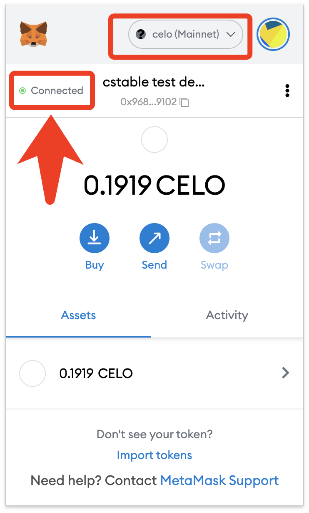

# Connect Your Wallet

CStable currently supports connections from a variety of wallets. While tutorials are only currently available for MetaMask, there will be tutorials for more wallet types in the future.

### Step 1: Connect Your Metamask Wallet with BSC

If you don’t already have a Metamask Wallet, check their [official website here](https://metamask.io)!

Once Metamask Wallet is set up, open it and select network.

.png>)

Select **Custom RPC** and configure the network as follows:

**Network name:** Celo (Mainnet)

**Added RPC URL:** [https://forno.celo.org](https://forno.celo.org)

**ChainID:** 42220

**Symbol:** CELO

**Block Explorer URL:** [https://explorer.celo.org](https://explorer.celo.org)

Make sure you **deposit some CELO** into your wallet on the Celo Blockchain Network and you will be ready to go!

If you are having trouble, [try Celo’s tutorial here](https://docs.celo.org/getting-started/wallets/using-metamask-with-celo).

### **Step 2: Connect your BSC Metamask Wallet with CStable**

Go to[ CStable.xyz](https://cstable.xyz/home/), click “connect wallet” on the upper right-hand corner and select Metamask.

MetaMask extension will pop up, select a wallet on the BSC Network!

Once successful, your Metamask wallet should display **“Connected”** on the upper right left corner. Make sure it is on the Binance Smart Network!

Now you are all set up to use all of CStable!

Full video tutorial coming soon...
